# NCSU Advising Chatbot — TuffyBot

An AI-powered academic advising assistant for NC State University.
Combines a **hybrid Retrieval-Augmented Generation (RAG)** pipeline, a **Neo4j-backed degree audit graph (DAG)**, and a **tool-calling LLM agent** behind a Shibboleth-authenticated web app.

> **Note:** This repository is a public showcase. The full source code is private.
> If you'd like to know more about the implementation, design choices, or technical decisions, I'm open to discussion — feel free to reach out.

---

## Table of Contents

- [Overview](#overview)
- [Architecture](#architecture)
- [Tech Stack](#tech-stack)
- [Scrapers](#scrapers)
- [RAG Pipeline](#rag-pipeline)
- [DAG — Degree Audit Graph](#dag--degree-audit-graph)
- [Authentication — Shibboleth SSO](#authentication--shibboleth-sso)
- [Agent / LLM Layer](#agent--llm-layer)
- [Contact](#contact)

---

## Overview

- Designed for NC State's **40,000+ student** population, with a modular, swappable component architecture for scaling.
- Lets a student upload a degree audit PDF, ask natural-language advising questions, and receive grounded answers with citations.
- Combines **semantic + keyword search** over scraped advising pages with a **graph-modeled course catalog** for prerequisite-aware recommendations.
- Self-hosted LLM (Llama 3.1) via Ollama on an NVIDIA GPU VM — no third-party API calls, FERPA-friendly.

---

## Architecture

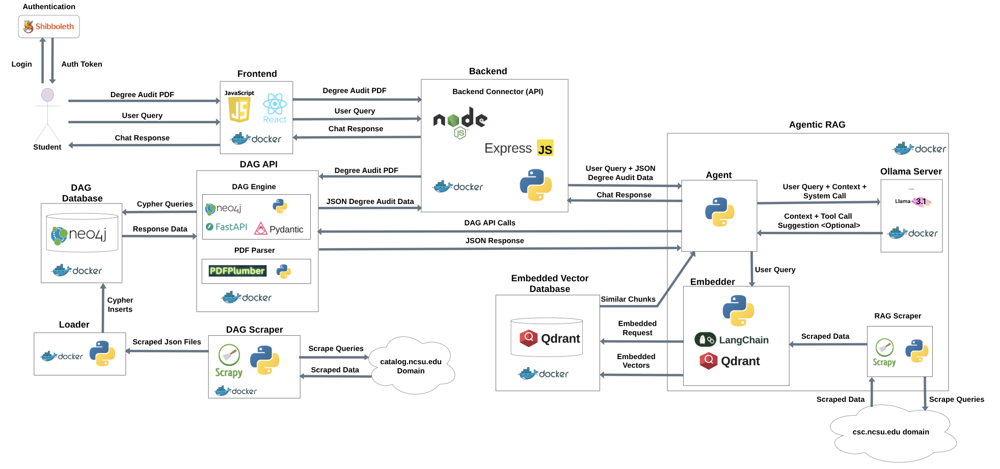

- **Frontend (React + Docker):** PDF upload, major/minor selection, chat UI.
- **Backend (Node.js + Express):** routes student requests to the DAG and Agent services.
- **Agentic RAG (Python + Ollama + Llama 3.1):** orchestrates retrieval and tool calls.
- **DAG API (Python + FastAPI + Neo4j):** prerequisite graph and degree audit engine.
- **Vector store (Qdrant):** stores 5,000+ embedded chunks for hybrid search.
- **Authentication (Shibboleth SAML SP):** gates access via NC State's identity provider.

---

## Tech Stack

| Layer | Tools |
|---|---|
| **Frontend** | React, JavaScript, Docker |
| **Backend** | Node.js, Express, Multer |
| **Agent / LLM** | Python, Ollama, Llama 3.1, LangChain (text splitter) |
| **RAG** | Qdrant (vector + BM25 hybrid), nomic-embed-text |
| **DAG** | Neo4j, Cypher, FastAPI, Pydantic |
| **PDF Parsing** | pdfplumber |
| **Scraping** | Scrapy (multi-spider, multi-domain) |
| **Auth** | Shibboleth SAML 2.0, Apache reverse proxy |
| **DevOps** | Docker Compose (8 services), NVIDIA Container Toolkit |

---

## Scrapers

Two Scrapy projects feed the system: one for the **course catalog** (DAG) and one for **advising content** (RAG).

- **DAG Scraper:** crawls `catalog.ncsu.edu` for courses and program requirements, normalizing prerequisite groupings (AND/OR semantics, slash codes like `EC/ARE 301`).
- **RAG Scraper:** crawls **7,000+ pages** across **6 NC State domains** (advising, policies, student services, careers, getinvolved, course catalog).
- Handles **static HTML and JS-rendered API endpoints** — falls back to public APIs when pages are JavaScript-only.
- Outputs JSON for the loader/embedder; idempotent and rate-limited per domain.

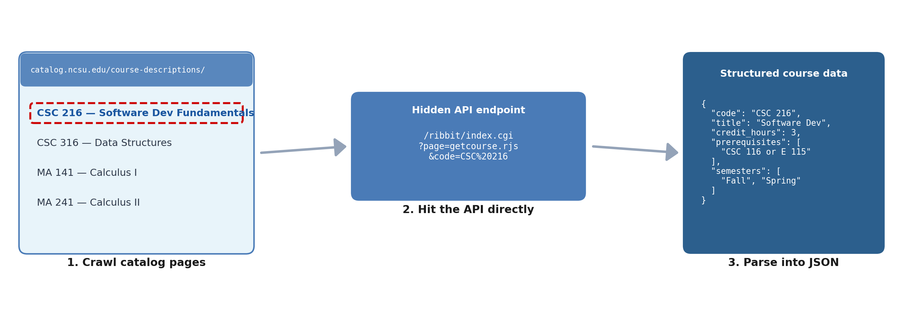

---

## RAG Pipeline

Hybrid retrieval over the embedded knowledge base feeds grounded context to the LLM.

- **5,120 chunks** embedded with `nomic-embed-text` (768 dimensions) and stored in **Qdrant**.
- **Hybrid search:** dense vector (semantic) + BM25 (exact term) merged via **Reciprocal Rank Fusion** — catches both natural-language questions and acronyms / course codes.
- **Top-8 retrieval** with title-prefixed embeddings for stronger context.
- Async ingest pipeline: scraping, chunking, and embedding run as a background job decoupled from query-time latency.

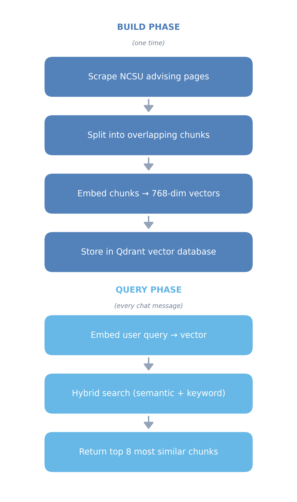

### Embedding space — visualizations

The hero image below is the full 5,120-chunk semantic similarity network. Nodes are coloured by source domain; edges connect chunks with cosine similarity > 0.82.

<table>
  <tr>
    <td width="50%">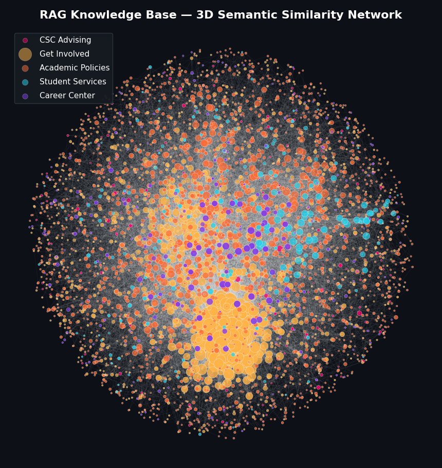 <b>3D projection</b> — depth-faded, same data rotated. An <b>interactive Plotly 3D version</b> (rotate/zoom/hover) is available on request.</td>
    <td width="50%"> <b>3-domain overlay</b> — Career Center + Student Services + CSC Advising. Larger nodes = more connected (high-degree chunks). Useful for spotting cross-domain bridges.</td>
  </tr>
  <tr>
    <td width="50%"> <b>Cross-domain similarity heatmap</b> — average cosine similarity between every pair of source domains. Lets us validate that the embedding space respects topical structure (Student Services ↔ CSC Advising overlap is highest).</td>
    <td width="50%">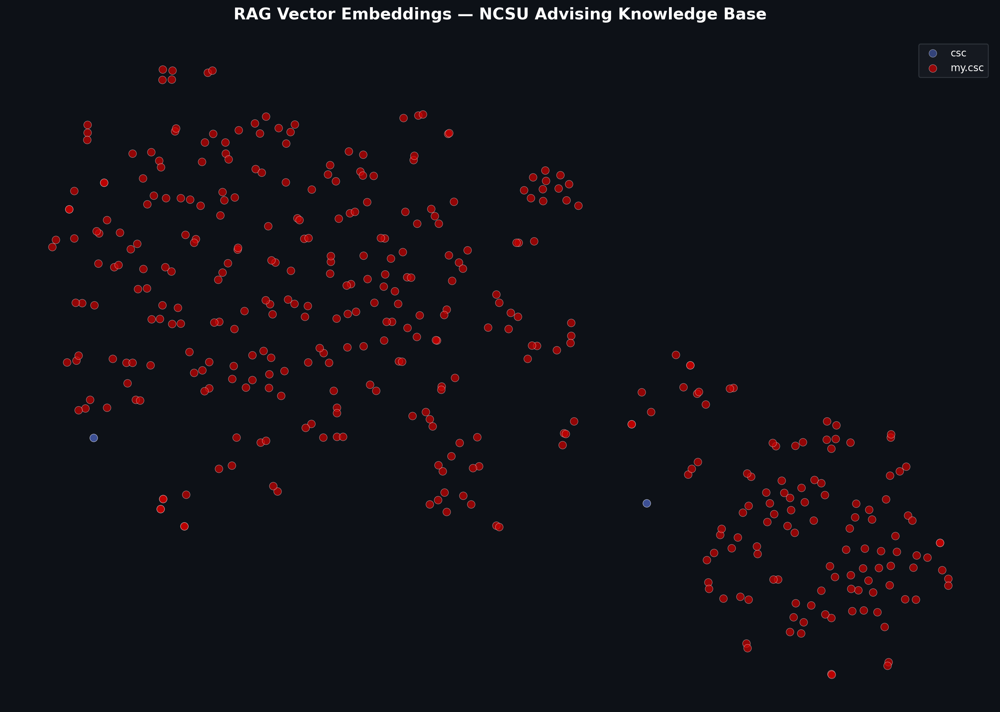 <b>Scatter view</b> — flat 2D projection of the embedding space, useful for inspecting individual clusters.</td>
  </tr>
</table>

---

## DAG — Degree Audit Graph

A **Neo4j directed acyclic graph** modeling the NC State course catalog and degree requirements.

- **1,000+ courses** as nodes; **89,000+ prerequisite + curriculum edges**.
- Encodes AND/OR prerequisite groupings, slash-code expansions, wildcard prefixes (e.g., `BIO ` matches any BIO course), and pool-based requirements (GEP, free electives).
- **4-pass allocation engine** matches a student's transcript against requirements: Required → Elective Groups → Pool Requirements → Free Electives. Prevents double-counting and validates prerequisite chains for planned courses.
- Exposed via a FastAPI service with endpoints for `/audit`, `/full-audit`, `/missing`, `/requirements`, `/programs`, `/courses`.

### Graph in Neo4j Bloom

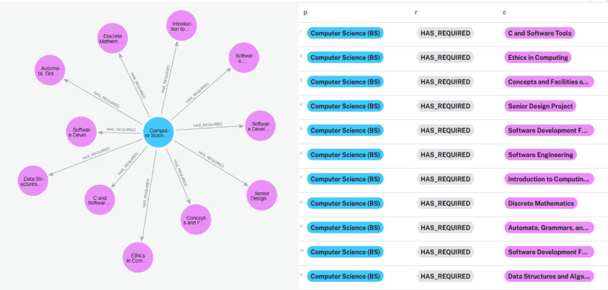
The Computer Science (BS) program node and its <code>HAS_REQUIRED</code> edges to every required course. Cypher result panel on the right shows the matching paths.

<table>
  <tr>
    <td width="50%">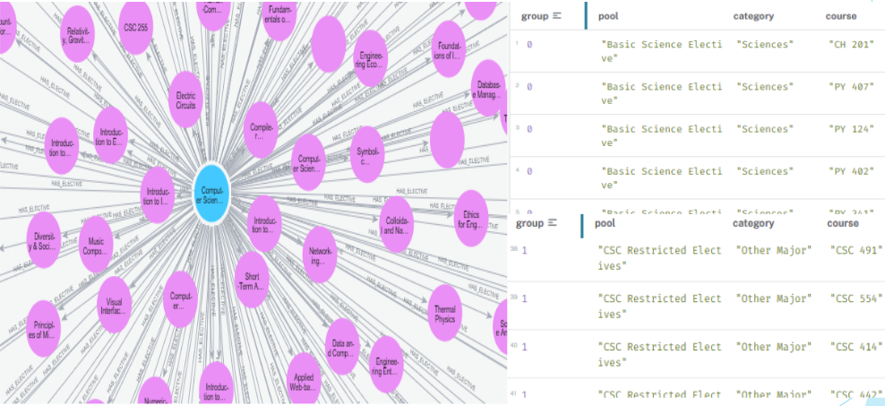 <b>HAS_ELECTIVE relationships</b> — elective groupings for the major, organized by group ID. Each group is a "pick N from these" requirement.</td>
    <td width="50%">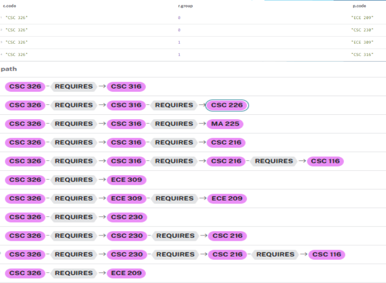 <b>Prerequisite paths</b> — recursive Cypher traversal showing every prerequisite chain feeding into <code>CSC 326</code>. The graph naturally encodes AND/OR with edge groups.</td>
  </tr>
  <tr>
    <td width="50%">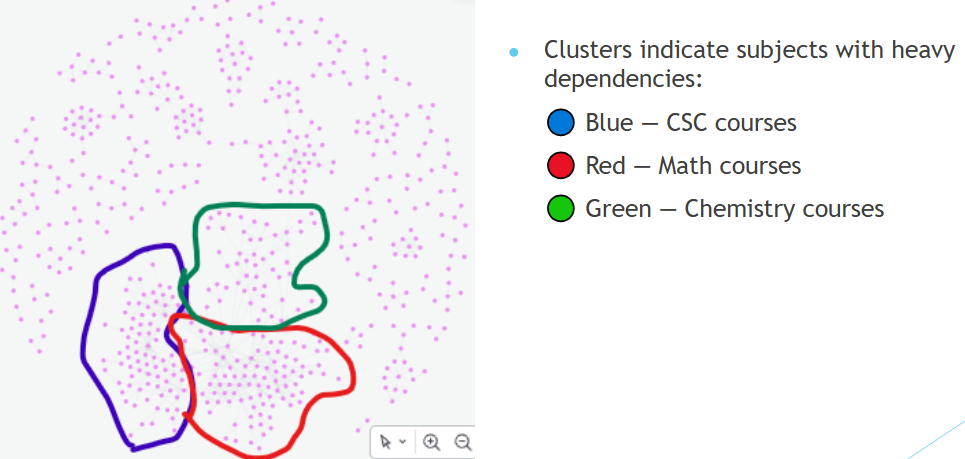 <b>Cluster structure</b> — laying out all 1,000+ courses by prerequisite connectivity reveals departmental clusters (CSC, Math, Chemistry) emerging from the topology alone.</td>
    <td width="50%">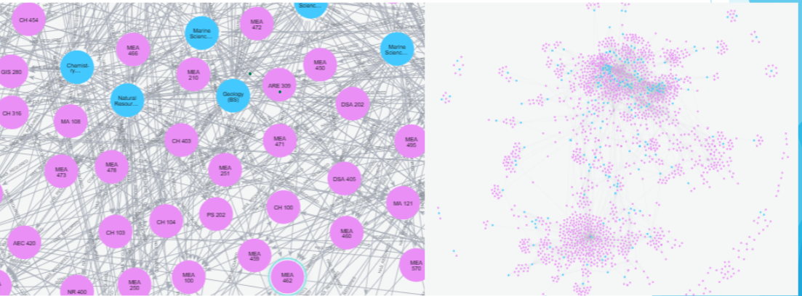 <b>Dimensions</b> — the full graph at scale; the dense central region is the highly-connected core curriculum (intro CS / math / writing).</td>
  </tr>
</table>

### PDF degree-audit parser

Uploaded transcripts are parsed via `pdfplumber` and normalized into the schema the DAG engine consumes.

---

## Authentication — Shibboleth SSO

NC State requires SAML-based authentication for any service touching student data.

- **Shibboleth 2.0 Service Provider** behind an **Apache reverse proxy**, federated with NC State's identity provider.
- Forwards trusted headers (`x-shib-uid`, `x-shib-eppn`, `x-shib-mail`, `x-shib-2fauthed`) to the Express backend.
- HTTPS termination at the proxy; backend services stay on the internal Docker network.
- Supports the campus 2FA requirement for faculty/staff accounts.

---

## Agent / LLM Layer

A custom tool-calling agent loop drives the chat experience.

- **Llama 3.1 8B** served via **Ollama** on an NVIDIA GPU VM — fully self-hosted, no third-party API.
- Manual `TOOL_CALL: name(arg)` parsing via regex — works around quantized-model limitations without sacrificing tool use.
- **6 tools** orchestrated by the agent:
  - `search_advising_info(query)` — hybrid RAG search
  - `search_programs(query)` — list majors/minors
  - `get_courses(prefix)` — list by department prefix
  - `get_course_info(code)` — single-course details
  - `get_requirements()` — full audit (completed + missing)
  - `get_missing()` — incomplete requirements only
- Multi-round agent loop (capped at 5 tool calls) feeds tool output back into context with explicit instructions to ground answers in retrieved data.
- Returns Markdown-formatted answers with **inline source links** to the original advising pages.

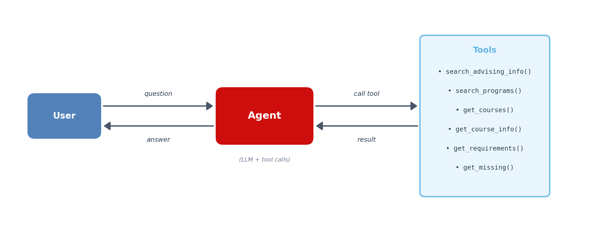

---

## Contact

**Luke Gentri**
CS @ NC State · Graduated May 2026
[lukegentri1@gmail.com](mailto:lukegentri1@gmail.com) · [LinkedIn](https://www.linkedin.com/in/luke-gentri-384b033a4/)

If you want to dig into any specific component — the agent loop, the audit engine, the hybrid search, or the deployment — I'm happy to walk through it.
